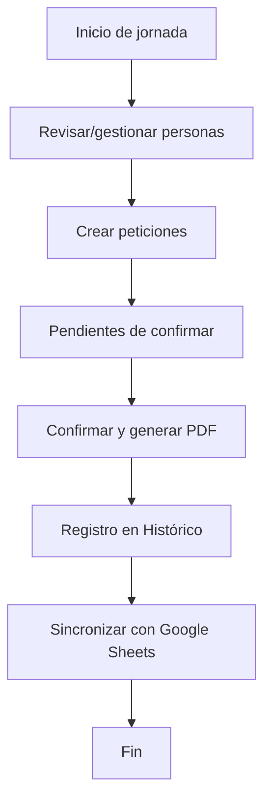
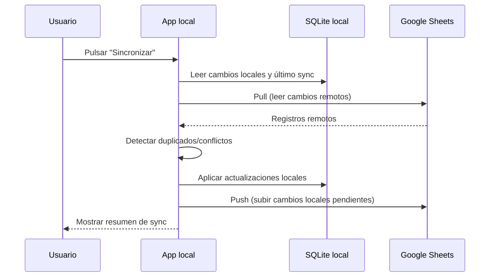

# Manual de Usuario — Horas Sindicales

> Versión del documento: 1.0  
> Público objetivo: personas usuarias de la aplicación de escritorio (delegadas, administración o soporte interno).

---

## 1) Instalación

### 1.1 Requisitos previos

- Python **3.10 o superior** (recomendado 3.12).
- Sistema operativo: Windows, Linux o macOS.
- Dependencias del proyecto (incluidas en `requirements.txt`): PySide6, reportlab, gspread y librerías de autenticación de Google.

### 1.2 Pasos de instalación

1. Clona el repositorio y entra en la carpeta del proyecto:

```bash
git clone <URL_DEL_REPOSITORIO>
cd Horas_Sindicales
```

2. Crea y activa un entorno virtual:

**Linux/macOS**
```bash
python3 -m venv .venv
source .venv/bin/activate
```

**Windows (PowerShell)**
```powershell
py -m venv .venv
.\.venv\Scripts\Activate.ps1
```

3. Instala dependencias:

```bash
pip install -U pip
pip install -r requirements.txt
```

4. Ejecuta la aplicación:

```bash
python main.py
```

### 1.3 Verificación rápida (opcional)

Si quieres validar recursos estáticos sin abrir la interfaz completa:

```bash
python main.py --selfcheck
```

---

## 2) Flujo principal de uso

El uso recomendado del sistema en un día operativo es:

1. **Gestionar personas** (altas/edición si aplica).
2. **Crear peticiones** de horas sindicales.
3. Revisar el panel de **Pendientes**.
4. **Confirmar y generar PDF** para formalizar solicitudes.
5. Consultar o exportar desde **Histórico**.
6. Ejecutar **Sincronización** con Google Sheets cuando corresponda.

### Diagrama de flujo (alto nivel)



---

## 3) Capturas / Diagramas

Como referencia operativa para documentación interna, se incluyen diagramas de proceso (alto nivel y sincronización). Si tu organización lo requiere, puedes complementar este manual con capturas reales de pantalla en:

- Pantalla principal (bloques: Peticiones, Pendientes, Histórico, Sincronización).
- Diálogo de generación de PDF.
- Resumen de sincronización y resolución de conflictos.

### Diagrama de sincronización (resumen)



---

## 4) Secciones detalladas

### 4.1 Peticiones

La sección **Peticiones** permite registrar solicitudes de horas sindicales.

#### Campos clave

- Persona delegada.
- Fecha de solicitud.
- Fecha solicitada (día de disfrute).
- Tipo de petición:
  - **Completa** (jornada completa).
  - **Parcial** (rango horario desde/hasta).
- Horas/minutos (manual u obtenido por cálculo).
- Observaciones.

#### Reglas importantes

- Si introduces minutos/horas manuales mayores que 0, prevalecen sobre el cálculo automático.
- En peticiones parciales, `hasta` debe ser mayor que `desde`.
- En peticiones completas, el sistema puede tomar el total del cuadrante diario.
- Una petición nueva nace como **pendiente**.

#### Buenas prácticas

- Verifica siempre la persona seleccionada antes de guardar.
- Usa observaciones para justificar casos no estándar.
- Evita crear entradas duplicadas para la misma fecha y tramo.

---

### 4.2 Pendientes

La sección **Pendientes de confirmar** agrupa solicitudes creadas pero no formalizadas aún.

#### Qué puedes hacer

- Revisar solicitudes antes de cerrar el lote.
- Eliminar o corregir solicitudes pendientes (si detectas errores).
- Confirmar el conjunto y generar PDF.

#### Impacto en saldos

- Las pendientes **no consumen** bolsa mensual/anual.
- El consumo se contabiliza cuando pasan a histórico (tras confirmación/documentación).

---

### 4.3 Histórico

La sección **Histórico** permite consultar solicitudes ya confirmadas/documentadas.

#### Funcionalidades habituales

- Filtrado por período o persona.
- Revisión de detalle de solicitudes tramitadas.
- Exportación a PDF histórico.

#### Cuándo usarla

- Auditoría interna.
- Revisión de consumos pasados.
- Preparación de informes para representación sindical o RR. HH.

---

### 4.4 PDF

La aplicación permite generar PDF tanto desde pendientes (confirmación) como desde histórico.

#### Contenido esperado del PDF

- Datos de persona y solicitud.
- Tramo horario o marca **COMPLETO**.
- Total de horas en formato HH:MM.
- Fila final **TOTAL** con suma de minutos convertida a HH:MM.

#### Recomendaciones

- Revisa vista previa antes de guardar/compartir.
- Usa nombres de archivo consistentes (ejemplo: `solicitudes_2026_02.pdf`).
- Conserva una copia local y, si aplica, otra en repositorio documental corporativo.

---

### 4.5 Sincronización

La sección **Sincronización Google Sheets** mantiene consistencia entre la base local y la hoja compartida.

#### Modos de sincronización

- **Pull**: trae cambios remotos a local.
- **Push**: envía cambios locales al remoto.
- **Sync completo**: combina pull + push.

#### Comportamientos relevantes

- Detecta conflictos cuando un mismo registro cambió en local y remoto desde el último sync.
- Evita duplicados funcionales durante pull/push.
- Registra resumen de elementos actualizados, omitidos y/o en conflicto.

#### Cuándo sincronizar

- Al iniciar jornada (para tener datos actualizados).
- Tras confirmar lotes relevantes.
- Antes de cerrar jornada o entregar informes.

---

## 5) Preguntas frecuentes (FAQ)

### ¿Qué diferencia hay entre “Pendiente” e “Histórico”?

- **Pendiente**: solicitud creada pero no formalizada; no consume bolsa.
- **Histórico**: solicitud confirmada/documentada; sí computa en consumos.

### ¿Puedo crear una petición completa sin tramo horario?

Sí. En modalidad completa, el cálculo puede basarse en cuadrante o en minutos manuales.

### ¿Qué pasa si intento duplicar una petición?

El sistema aplica reglas de deduplicación local (y también durante sincronización), por lo que una solicitud equivalente puede ser bloqueada u omitida.

### ¿Es obligatorio sincronizar cada vez que genero un PDF?

No es obligatorio técnicamente, pero sí recomendable para mantener consistencia entre equipos y fuentes.

### ¿Dónde se guardan mis datos?

En base de datos **SQLite local** (y opcionalmente en Google Sheets si usas sincronización).

---

## 6) Solución de problemas comunes

### Problema 1: La app no arranca

**Posibles causas:**
- Entorno virtual no activado.
- Dependencias sin instalar.
- Versión de Python incompatible.

**Acciones recomendadas:**
1. Verifica versión: `python --version`.
2. Reinstala dependencias: `pip install -r requirements.txt`.
3. Ejecuta self-check: `python main.py --selfcheck`.

### Problema 2: Error al sincronizar con Google Sheets

**Posibles causas:**
- Credenciales inválidas o ausentes.
- API de Google no habilitada.
- Permisos insuficientes sobre la hoja.

**Acciones recomendadas:**
1. Revisa archivo de credenciales y configuración.
2. Verifica permisos de la cuenta en la hoja.
3. Reintenta sincronización y revisa el mensaje de error detallado.

### Problema 3: No se genera el PDF

**Posibles causas:**
- Datos incompletos en solicitudes.
- Problema de permisos de escritura en carpeta destino.

**Acciones recomendadas:**
1. Prueba guardar en otra carpeta (por ejemplo, Documentos).
2. Reduce filtros/volumen para aislar el caso.
3. Revisa si existen mensajes de validación en pantalla.

### Problema 4: Los totales no coinciden con lo esperado

**Posibles causas:**
- Diferencia entre horas manuales y cálculo automático.
- Confusión entre pendientes e histórico.

**Acciones recomendadas:**
1. Revisa si la solicitud fue parcial o completa.
2. Confirma el valor final de minutos almacenado.
3. Comprueba si la solicitud ya fue confirmada (histórico).

---

## 7) Contacto de soporte (placeholder)

> **Soporte funcional:** soporte-funcional@tu-organizacion.example  
> **Soporte técnico:** soporte-tecnico@tu-organizacion.example  
> **Horario de atención:** L-V 09:00 a 18:00  
> **Canal alternativo:** +34 600 000 000

---

## Anexo A — Checklist operativo rápido

- [ ] Entorno activo y app abierta.
- [ ] Persona correcta seleccionada.
- [ ] Peticiones registradas y revisadas.
- [ ] Pendientes confirmadas con PDF.
- [ ] Histórico revisado si aplica.
- [ ] Sincronización ejecutada sin conflictos pendientes.
